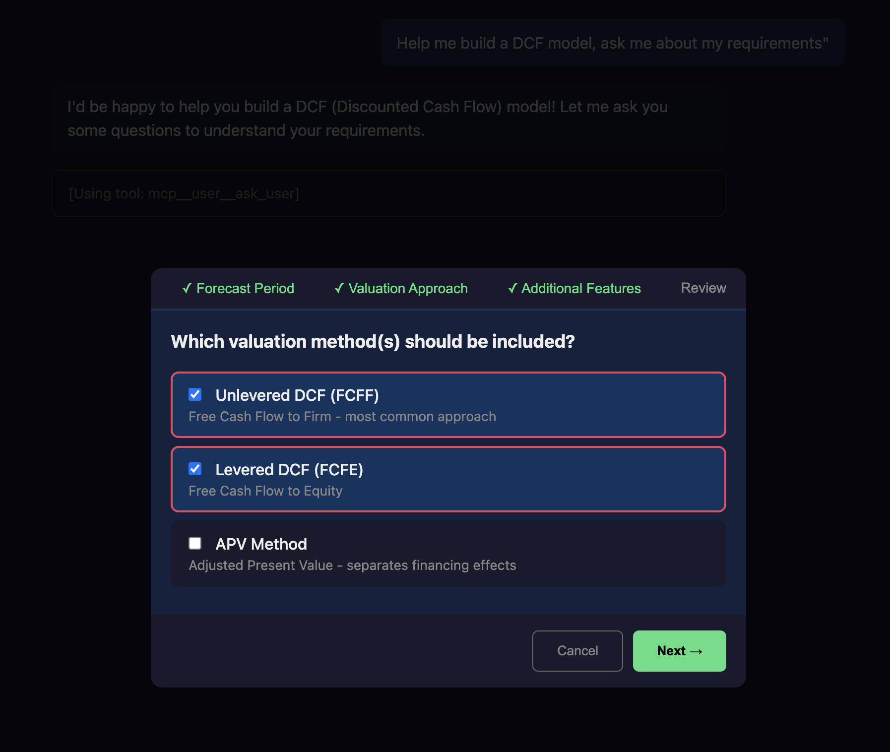
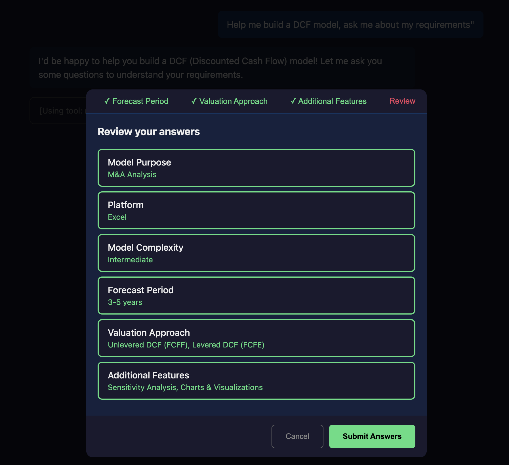
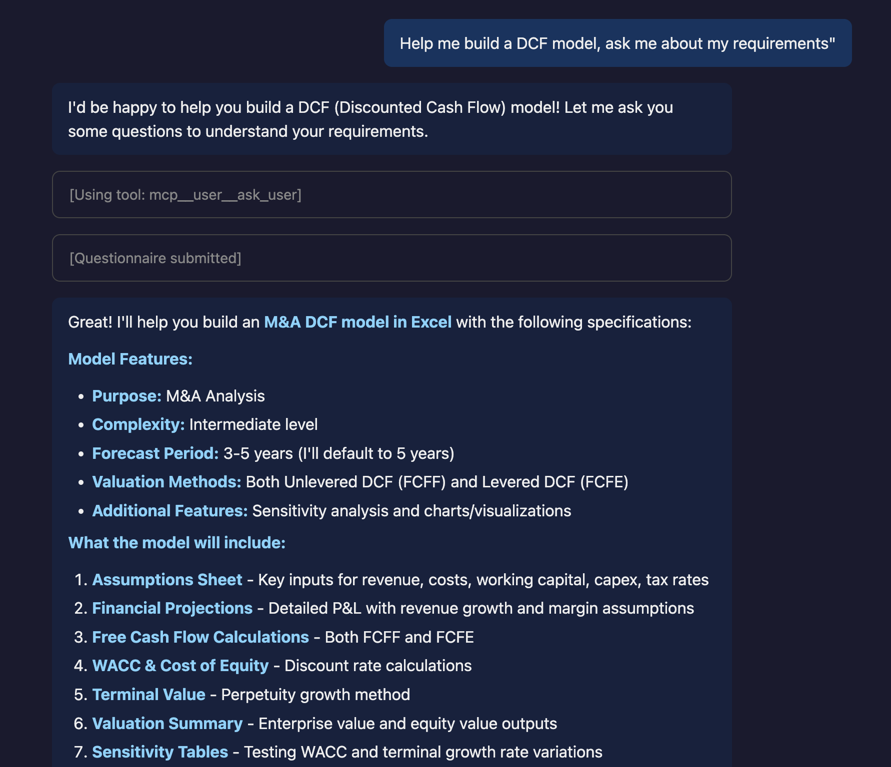

# AskUserQuestion via MCP - Interactive Tools for Claude Agent SDK

A proof-of-concept showing how to implement interactive user prompts when Claude Code runs as a non-interactive subprocess.



## The Problem

Claude Code's built-in `AskUserQuestion` tool doesn't work in non-interactive mode (SDK, CI/CD, subprocess). When you build apps using the Claude Agent SDK, Claude can't ask users for input mid-conversation.

```
Claude Agent SDK → spawns → Claude Code CLI (non-interactive)
                                    ↓
                         AskUserQuestion ❌ (no TTY)
```

## The Solution

Use **SDK MCP Servers** to create custom tools that run in your process. When Claude calls the tool, your code handles it - including prompting users interactively.

```
Your App (interactive)
    ├── Claude SDK Client
    │   └── MCP Server with ask_user tool
    │       └── Tool handler → prompts user → returns answer
    │
    └── Claude Code CLI (subprocess, non-interactive)
            └── Calls mcp__user__ask_user → waits → gets answer
```

## How It Works

This demo implements a web-based chat with questionnaire support:

```
Browser                              Server
   │                                    │
   ├─POST /chat─────────────────────────▶  Start Claude session
   │                                    │
   ◀──SSE: {type:"assistant",...}───────┤  Stream response
   ◀──SSE: {type:"questions",...}───────┤  Tool triggered (handler waits)
   │                                    │
   │  [Modal appears, user fills form]  │
   │                                    │
   ├─POST /answers──────────────────────▶  Unblock handler
   │                                    │
   ◀──SSE: {type:"assistant",...}───────┤  Claude continues with answers
   ◀──SSE: {type:"done"}────────────────┤
```

Key pattern: `asyncio.Event` blocks the MCP tool handler until answers arrive via HTTP POST.

## Features

- Multi-question forms with tabs
- Single-select (radio) and multi-select (checkbox)
- Markdown rendering in chat
- Conversation history persistence
- SSE streaming (no WebSocket needed)

<details>
<summary>More Screenshots</summary>

### Review Screen


### Final Response with Markdown


</details>

## Quick Start

```bash
git clone https://github.com/anthropics/ask-user-mcp-demo
cd ask-user-mcp-demo
make install
make run
```

Open http://localhost:8000 and try: *"Help me build a DCF model, ask me about my requirements"*

### Available Commands

```
make install    # Install dependencies
make run        # Run web demo (http://localhost:8000)
make run-tui    # Run terminal TUI demo
make clean      # Remove cache/build artifacts
make help       # Show all commands
```

## Project Structure

```
├── server.py       # FastAPI server + Claude SDK + MCP tool
├── index.html      # Chat UI + questionnaire modal
├── tui_example.py  # Terminal TUI version (Textual)
├── Makefile        # make install/run/run-tui
├── pyproject.toml
└── README.md
```

## Key Code

### Defining the MCP Tool

```python
from claude_agent_sdk import tool, create_sdk_mcp_server

@tool("ask_user", "Ask user questions", ASK_USER_SCHEMA)
async def ask_user_tool(args):
    # Send questions to browser via SSE
    await queue.put({"type": "questions", "questions": args["questions"]})

    # Wait for answers (blocks until POST /answers)
    await event.wait()

    return {"content": [{"type": "text", "text": format_answers()}]}

server = create_sdk_mcp_server(name="user", tools=[ask_user_tool])
```

### Configuring Claude to Use It

```python
options = ClaudeAgentOptions(
    mcp_servers={"user": server},
    allowed_tools=["mcp__user__ask_user"],      # Whitelist our tool
    disallowed_tools=["AskUserQuestion"],        # Block native tool
)
```

### The Async Wait Pattern

```python
pending_events: dict[str, asyncio.Event] = {}
pending_answers: dict[str, dict] = {}

# In tool handler:
event = asyncio.Event()
pending_events[question_id] = event
await event.wait()  # Blocks here
answers = pending_answers[question_id]

# In POST /answers endpoint:
pending_answers[question_id] = submitted_answers
pending_events[question_id].set()  # Unblocks tool handler
```

## Adapting for Your Use Case

This pattern works for any interactive tool:

- **File picker**: Tool sends file list → user selects → tool returns selection
- **Approval workflow**: Tool shows diff → user approves/rejects → tool returns decision
- **Configuration wizard**: Tool presents options → user configures → tool returns config

The key insight: your MCP tool handler runs in YOUR process, so you control the interaction.

## TUI Version

There's also a terminal-based version using [Textual](https://textual.textualize.io/) in `tui_example.py` - same pattern, different UI.

## Requirements

- Python 3.11+
- Claude Agent SDK (`claude-agent-sdk`)
- FastAPI + uvicorn
- Active Claude API key or Claude Code authentication

## License

MIT
